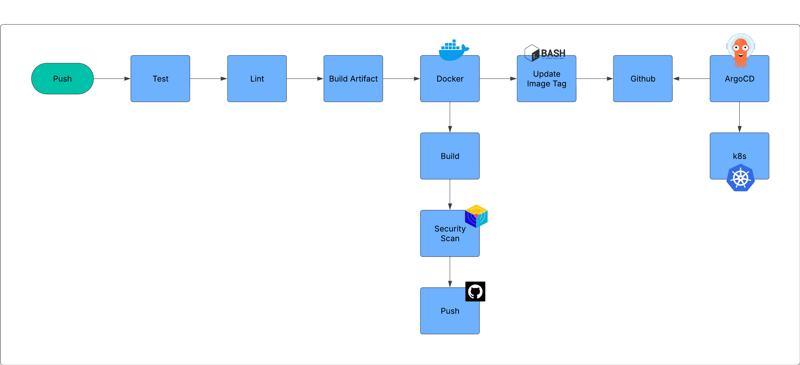
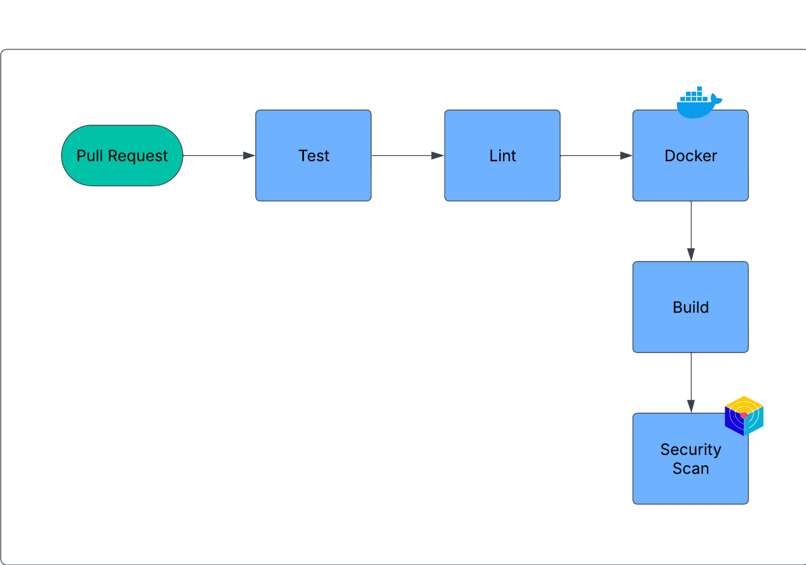

# Go Web Application – DevOps Edition

[](https://github.com/HasanAshab/go-web-app-devops/actions/workflows/ci.yaml)  
[](https://github.com/HasanAshab/go-web-app-devops/pkgs/container/go-web-app-devops)

This is a DevOps-enhanced deployment of a [basic Golang web application](https://github.com/iam-veeramalla/go-web-app), restructured and productionized with best practices for containerization, CI/CD, observability, and Kubernetes.

---

## 🚀 DevOps Features Implemented

* **Dockerized Build**: Multi-stage Dockerfile for efficient image creation.
* **Local Development**: `docker-compose` support with live reload for rapid iteration.
* **Helm Charts**: Kubernetes deployment configuration under `charts/go-web-app`.
* **CI with GitHub Actions**: Automated testing and container builds.
* **Monitoring-Ready**: Application exposes Prometheus metrics.
* **CD via Argo CD**: Managed from infrastructure repo using GitOps.

---

## 🧑‍💻 Local Development

To spin up the application locally:

```bash
docker-compose up
````

Once running, the server will be accessible at:
**[http://localhost:8080/courses](http://localhost:8080/courses)**

Live reload is enabled—code changes are automatically reflected.

---

## 📦 Helm Chart

The Kubernetes deployment is managed via Helm.

To install the chart locally:

```bash
helm install go-web-app ./charts/go-web-app
```

This chart is also used in the production setup managed by Argo CD.

---

## 📡 Infrastructure & Deployment

Infrastructure provisioning (EKS, Argo CD, monitoring stack, etc.) is managed in a separate repository:

> 🔗 **[go-web-app-infra](https://github.com/HasanAshab/go-web-app-infra)** – contains Terraform, Argo CD Application definitions, and Helm values used to deploy this app.

Argo CD automatically deploys the Helm chart from this repository (`charts/go-web-app`) using GitOps.

---

## 📊 Monitoring (Prometheus & Grafana)

The application is instrumented with Prometheus metrics. Dashboards and the monitoring stack are deployed from the infrastructure repository.

---

## 📷 UI Preview


---

## ⚙️ CI/CD Pipeline

This project is equipped with a robust DevSecOps CI/CD pipeline via GitHub Actions:

* **Push Pipeline**
  

* **Pull Request Pipeline**
  

---

## 📈 Future Improvements

* Add integration tests to CI
* Configure alerting rules in Prometheus
* Create custom Grafana dashboards
* Add OpenTelemetry for distributed tracing

---

## 🙋‍♂️ About Me

**Hasan Ashab** – DevOps Engineer
🔗 [LinkedIn](https://www.linkedin.com/in/hasan-ashab)
